<picture>
  <source media="(prefers-color-scheme: dark)" srcset="assets/banner-dark.svg">
  <source media="(prefers-color-scheme: light)" srcset="assets/banner-light.svg">
  
</picture>

I build full-stack apps, DevOps-friendly scripts, and smart contracts, most of them aimed at fairness and transparency. I would rather ship a small feature people can use than sit on a big one that never leaves my machine.

## Now

- Learning **Rust**, **data science and ML**, and **Flutter**.
- Open to internships.

<!-- Uncomment if you want these public:
- Software Engineering student at African Leadership University, Kigali.
- Technical intern at GlobX Commerce Ltd, working on Odoo ERP implementation and client data migration.
-->

## Selected work

**Healthcare Survey** &nbsp;·&nbsp; Patient-first intake and recommendation flow for safer medication decisions.
`React` `Node` `PostgreSQL` `Docker`

**Transparent Payroll** &nbsp;·&nbsp; Smart contract prototypes for on-time payment and auditability, IoC-based deployments.
`Motoko` `Solidity` `Internet Computer`

**AI Productivity Mobile** &nbsp;·&nbsp; Prototype that suggests micro-tasks and learning paths to lower unemployment barriers.
`Flutter` `ML inference`

Smaller shell utilities and scripts live in the repos below.

## Stack

| | |
|---|---|
| **Languages** | JavaScript, Python, Bash, Rust |
| **Frontend** | React, Flutter |
| **Backend** | Node.js, PostgreSQL |
| **Contracts** | Solidity, Motoko |
| **Tooling** | Docker, Git, Jupyter, VS Code |

<!-- Optional: a collapsible section reads well here. Write it in your own words and uncomment.

<b>How I work</b>

 

Two or three sentences on how you approach a build. Keep it specific.

-->

## Numbers

  
  

## Reach me

| | |
|---|---|
| Email | `sanorod00@gmail.com` |
| LinkedIn | [sano-rodrigue](https://www.linkedin.com/in/sano-rodrigue-ab3849331) |
| YouTube | [@SanoRodrigue](https://www.youtube.com/@SanoRodrigue) |

Keep it simple. Code it clean. Deploy with purpose.
